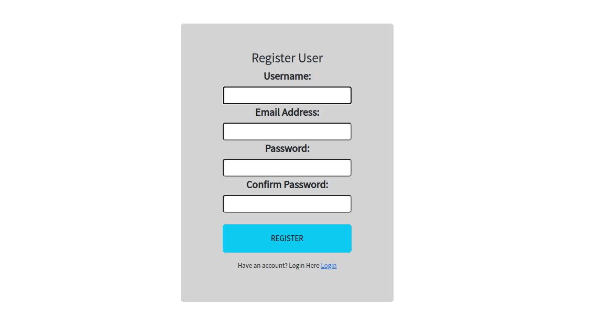
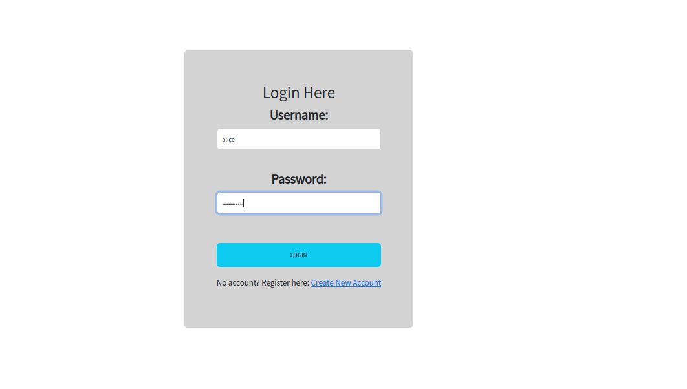
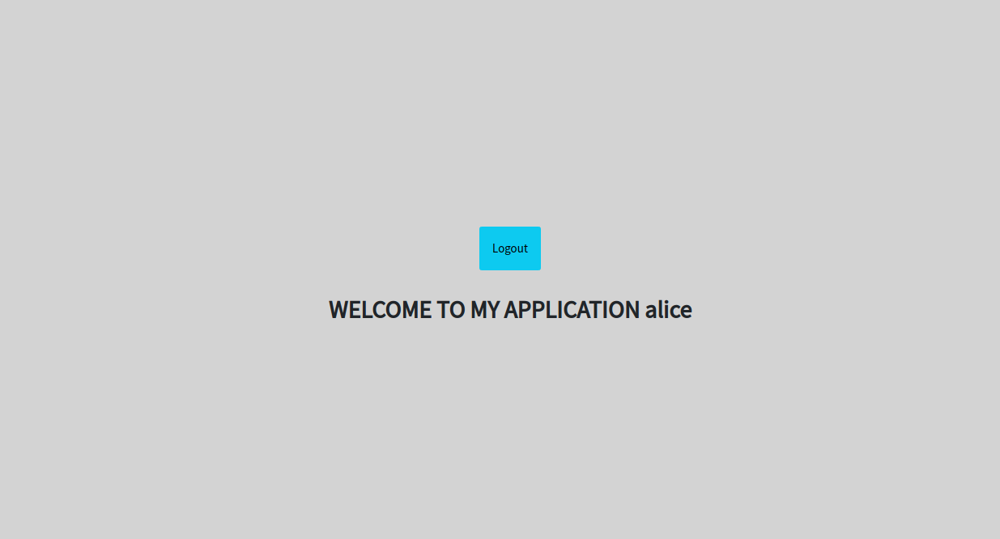

## User Application

This project was created by Alice Githui.

## Deployed Link
[Deployed Application](https://xtranet.herokuapp.com/)

## Description
This is a application where a user can register using their name, email and password. After registration, they are re-directed to the login page where they login using their credentials and are redirected to the application's homepage. 

They are logged out of the application after 15secs of inactivity

This application is screen responsive

## Technologies Used

-Python V3.9 
 
-Django framework

## Working Project
## Registration

## Login Form

## Homepage after Login

## Installation and Set-up

To acquire a local copy:

- Clone the repository to your desired location/folder
- Create a virtual environment and activate it to create a mini-environment/system
- In your terminal, run the command pip install -r requirements.txt to install all the application dependencies 
- Open the app on your preferred editor i.e Visual Studio Code to view the source code
- Run the app by running python3 manage.py runserver command to run the application on a local environment

## Known Bugs
- None at the moment

## Further Improvements
- Implement the auto-logout when a session is idle for 30seconds

## License

The MIT License (MIT)

<a href = "https://www.mit.edu/~amini/LICENSE.md">MIT License(MIT)</a>

## Deployed Link

## Contacts

For any further questions, contributions or feedback ,get in touch with me through the following contacts;

 
email: gnyokabi.alice@gmail.com

